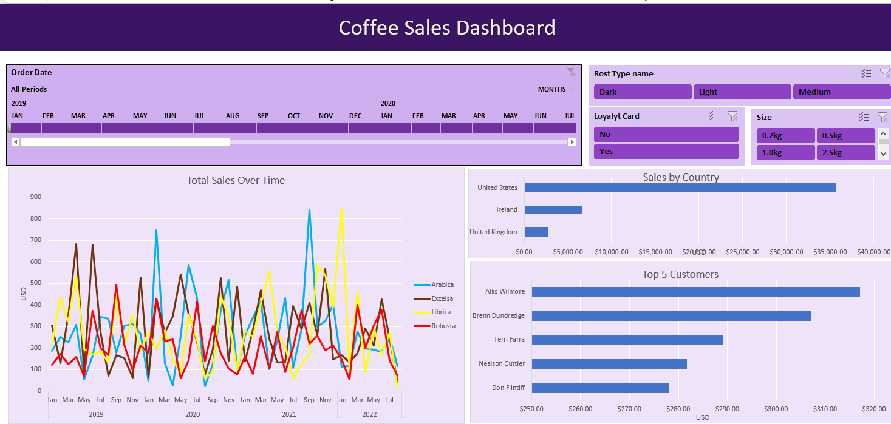

# Coffee_Orders_Dashboard

## :coffee: Project Overview  

This project demonstrates the use of PivotTables and PivotCharts to create a dynamic and interactive dashboard for analyzing coffee orders. The dashboard includes the following key features:

- **Line Chart:** Displays total sales over time, segmented by coffee type.
- **Bar Chart:** Illustrates sales by country for a comprehensive geographical analysis.
- **Top 5 Customers:** A bar chart highlighting the top five customers based on sales.
- **Interactive Timeline:** Allows manipulation of visuals to explore data trends over specific periods.
- **Slicers:** Enables filtering by roast type, size, and loyalty card status for customized insights.
  
